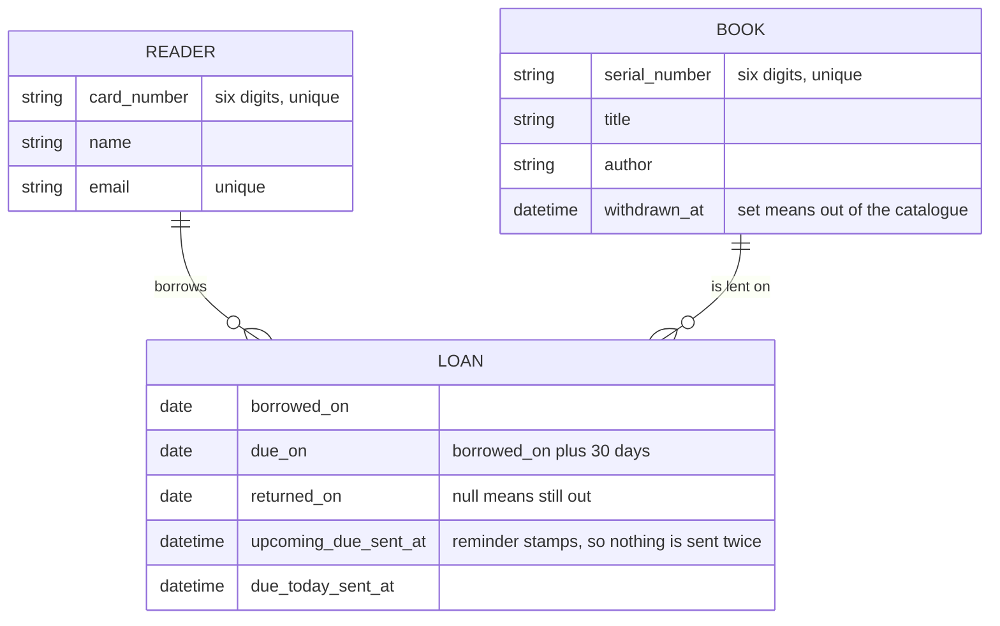
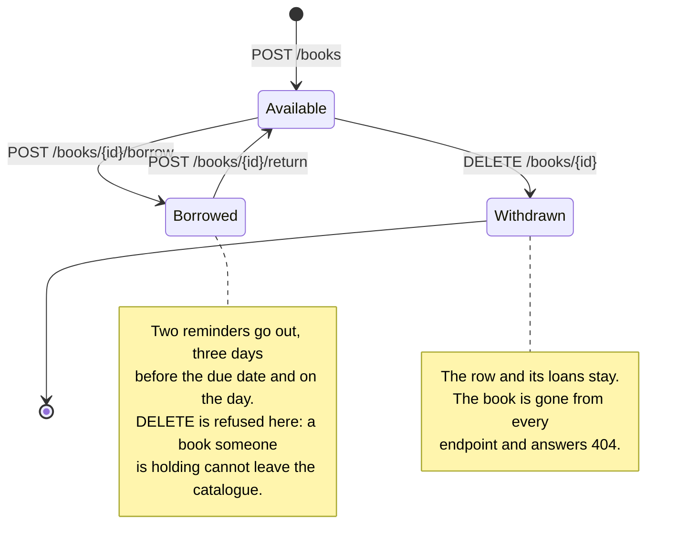

# Library System

A Rails API for library staff to manage books, borrowing and returns, with
automated return reminders.

## Running It

```sh
docker compose up
```

That is the whole setup. Four services come up in order: PostgreSQL and Redis
first, then the API once they are healthy, then the Sidekiq worker once the API
has prepared the database. The catalogue is created and seeded on first boot, so
there is something to read straight away.

The API is on `http://localhost:3000`. If something already holds that port,
move it:

```sh
PORT=3003 docker compose up
```

Database contents survive `docker compose down`. To start over from an empty
catalogue, remove the volume with `docker compose down -v`.

## How It Fits Together

Three tables. A loan joins a book to a reader, and every question the API
answers comes from those rows.



A book moves between three states, and every move is one endpoint.



## Jobs and Schedules

| Job                             | Queue       | When it runs                             | What it does                                                                                                                        |
| ------------------------------- | ----------- | ---------------------------------------- | ----------------------------------------------------------------------------------------------------------------------------------- |
| `ReminderSweepJob`              | `reminders` | Every day at 07:00 UTC                   | Finds the loans due in three days and the ones due today, mails each reader once, and stamps the loan so a second run sends nothing |
| `ActionMailer::MailDeliveryJob` | `default`   | Whenever the sweep finds someone to mail | Renders one reminder and delivers it. One job per mail, so a bad address retries on its own instead of stopping the sweep           |

The schedule is `config/schedule.yml`, read by Sidekiq on startup. The Cron tab
at `/sidekiq/cron` shows it and when it last ran.

## The API

The full contract is `openapi.yaml` in the repository root. It is also browsable
at `/api-docs`, which renders it with Swagger UI.

| Method | Path                       | What it does                              |
| ------ | -------------------------- | ----------------------------------------- |
| GET    | `/api/v1/books`            | The catalogue, filterable by availability |
| POST   | `/api/v1/books`            | Add a book                                |
| GET    | `/api/v1/books/:id`        | One book with its full borrowing history  |
| DELETE | `/api/v1/books/:id`        | Remove a book from the catalogue          |
| POST   | `/api/v1/books/:id/borrow` | Lend it to a reader                       |
| POST   | `/api/v1/books/:id/return` | Take it back                              |
| GET    | `/api/v1/readers`          | The readers                               |
| POST   | `/api/v1/readers`          | Register a reader                         |

Successful responses are wrapped in `data`, with `meta` alongside on lists.
Failures are a list of `errors`, each with a machine-readable `code`, a
human-readable `detail`, and `source` naming the field at fault where there is
one.

## Background Jobs

Reminders go out on a schedule, so the app needs Redis and a Sidekiq process
next to the web server. The compose stack starts both. Outside it:

```sh
redis-server
bundle exec sidekiq
```

To see the sweep work without waiting for 07:00:

```sh
docker compose exec web bin/rails reminders:sweep
docker compose exec web bin/rails reminders:sweep DATE=2026-09-14
```

The mails land as `.eml` files inside the worker, one per reader:

```sh
docker compose exec worker ls tmp/mails
```

The seeds leave one loan in each reminder state, so the first sweep on a fresh
database sends two mails.

Open `/sidekiq` for the dashboard: queues, retries, and a Cron tab showing the
schedule and when it last ran. It has no authentication, which is fine for a
local stack and would not be in production.

## Reminder Mails Templates

Two emails: one for a book due in three days, one for a book due today. Both
are sent as multipart, with a plain text part and an HTML part.

Preview them in a browser:

```sh
bin/rails server
```

Open `/rails/mailers` and pick a reminder. Each one renders with a switcher
between its HTML and text parts.

Reminders sent in development are written to `tmp/mails` as `.eml` files, one
per recipient, appended to on each send.

## Decisions

**Soft delete instead of hard delete.** A book leaves the catalogue, its loans
stay. A library that throws a book out and forgets who borrowed it has lost the
thing it was asked to track.

**Status derived from the loans instead of a column.** `available` is computed,
never stored. A stored flag can disagree with the loans, for example after a
crash between writing the loan and flipping the flag. A computed one cannot.

**One active loan per book left to the database.** A partial unique index on
open loans refuses the second one. Two librarians clicking borrow on the same
copy at the same moment: one gets the loan, the other gets a 409. No check in
Ruby can promise that.

**A lock on the book row for borrow, return and delete.** Without it, a delete
can land between "is this book out?" and writing the loan, and the library ends
up with a withdrawn book sitting in someone's bag.

**Services return plain hashes with symbol codes, not exceptions.** The domain
says `{ error: :book_already_borrowed }`. The controller turns that into a 409
and the sentence comes from a locale file. Business rules stay out of HTTP, and
English stays out of the domain.

**Dates instead of timestamps for the loan.** A 30 day loan is a calendar thing.
"Due on the 14th", not "due at 14:32:07".

**`due_on` stored instead of calculated on read.** The loan period is policy and
policy changes. A book borrowed today should still be due in 30 days after
someone changes it to 21.

**Reminders stamped on the loan.** Each mail records when it went out, so
running the sweep twice in a day sends nothing the second time. That also
answers "when were they told", which is the question support actually gets.

**Reminders sent through a queue, not inline.** One mail per job. A bad address
fails and retries on its own rather than stopping the sweep halfway down the
list.

**UTC everywhere.** Same date here, in CI, and in the container. Reminder dates
are the one thing a timezone could quietly break.

**One error shape for everything.** `code` for machines, `detail` for people,
`source` for the field at fault. A client switches on `code` and never parses a
sentence.

**Development mode in the container.** Seeded data, mails you can open in
`tmp/mails`, working previews. Production mode would hide all three behind
configuration this stack has no use for.

## Future Improvements

**A lost book has nowhere to go.** A reader who loses a book cannot return it,
so the book cannot be withdrawn either, and it reads as borrowed forever. The
only way out today is to press return, which records a book coming back that
never did. That lie is the real cost, because later nobody can tell which
returns were real.

The fix is one column, `lost_on`, on the loan. It marks the loan without closing
it, so the copy stays blocked and the book keeps reading as unavailable, which is
the truth: it is not on the shelf. Withdrawing then becomes possible, and the
history says what happened. Borrowed on the 1st, never returned, declared lost on
the 20th.

**A found book.** If it turns up while the copy is still in the catalogue,
nothing new is needed: the loan is still open, so returning it works and the
record carries both dates. If it turns up after the copy was withdrawn, it is
stuck. The book answers 404 everywhere and cannot be added again, because serial
numbers stay unique across withdrawn books on purpose. That case needs an action
that clears `withdrawn_at`.

**Other things left out.** No authentication.

## Gems

Everything added beyond a stock `rails new --api`, and why.

| Gem                 |                                                                                                    |
| ------------------- | -------------------------------------------------------------------------------------------------- |
| `pg`                | Plan is to use PostgreSQL db                                                                       |
| `alba`              | Serialization stays explicit and out of the models, didn't go with jsonapi standard for simplicity |
| `oj`                | JSON backend Alba supports                                                                         |
| `sidekiq`           | Retries and monitoring come built in                                                               |
| `sidekiq-cron`      | Scheduling without a second process or system cron                                                 |
| `pagy`              | Smallest and fastest of the pagination gems                                                        |
| `rspec-rails`       | Test library                                                                                       |
| `factory_bot_rails` | Named, composable states rather than fixtures                                                      |
| `faker`             |
| `shoulda-matchers`  | One line per validation instead of hand-rolled assertions                                          |
| `simplecov`         | Shows what the suite misses                                                                        |

Retained from the generator: `puma`, `bootsnap`, `debug`, `tzinfo-data`,
`brakeman`, `bundler-audit` and `rubocop-rails-omakase`.
